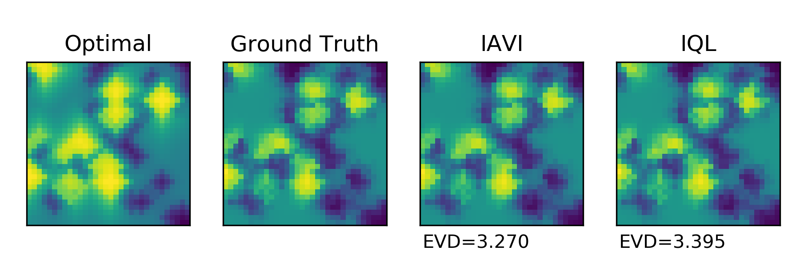

# Inverse_Q_learning
Implementation of algorithms proposed in *Deep Inverse Q-learning with Constraints (Kalweit et al., 2020)*

Arxiv: https://arxiv.org/abs/2008.01712

This repository contains the implementation of ***inverse action value iteration (IAVI)*** and ***inverse Q-learning (IQL)*** proposed in the article.

## Requirements
```
python==3.8.12
matplotlib==3.1.2
numpy==1.18.1
```
To install the requirements:
```
pip install -r requirements.txt
```

## Training

To train IAVI, run *train_iavi.py* : 
```
python train_iavi.py
```
To train IQL, run *train_iql.py* : 
```
python train_iql.py
```
## Results

